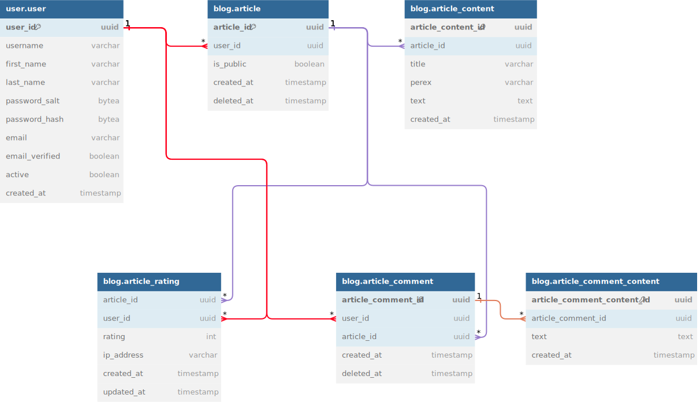

# Blogging service

## Project info

- Project runs on: http://localhost:3000/
- Swagger runs on: http://localhost:3000/api-docs
- Apollo Sandbox runs on: http://localhost:3000/graphql
- Default login is:
    - username: 'username'
    - password: 'string'

I designed the DB structure with being able to see what the user comment/posted without losing the information when he
deletes or updates it. <br />
This is to be able to monitor what the user was doing for safety. <br />

I tried to create the app to the best of my ability. Time did not allow me to do everything to perfection.<br />
I strived to make everything working even if it meant not finishing all to 100% (i.e. not making all graphQL endpoints, but making at least a few).

### The App features:

- Fully functioning REST API with Swagger
  - Users can log in and register
  - It is possible for users to manage their own articles/comments/rating when logged in
  - Public articles are available to user even if they are not logged in

- Dockerized local DB for development
    - The DB has to be initialized and seeded manually as per instructions below
- Dockerized App + DB to run the app with all dependencies
    - The DB is automatically initialized and seeded with data

- Functioning Apollo Sandbox
  - with working mutations for register/login

- Unit Test
  - Example unit tests in modules/auth

- Quality of Life improvements:
  - Custom decorators for type checking
  - Validated .env config and simpler usage 
  - Generated types from Prisma
  - Custom @module structure to allow for cleaner and simpler usage

## DB diagram



## Project setup for local development

```bash
$ pnpm install

# if you want to develop without DB
# use this to generate just the PrismaService data
$ pnpm prisma:gen

# setup DB 
# you need to copy data from .env.example > .env 
$ docker-compose -f docker-compose.local.yml up

$ pnpm prisma:init

$ pnpm prisma:seed
```

## Compile and run the project

```bash
# development
$ pnpm start:dev
```

## Work with updated DB types
When there are changes made in the prisma/schema.prisma you should:
``` bash
# regenerate types
$ pnpm prisma:gen

# types are generated into src/posgres/generated-types which is git ignored folder
# you have to copy the needed types into src/posgres/types
```

## Run tests

```bash
# when tests fail on not existing prisma types  run
$ pnpm prisma:gen

# unit tests
$ pnpm test
```

## Kill local DB and delete volumes
Use with Caution!
Run this when you cannot run the docker-compose for app.

```bash
$ docker-compose -f docker-compose.local.yml down --volumes  
```

## Run app and DB in docker

Starts the DB, sets it up and seeds it with data. Then starts the blogging service app.

```bash
$ docker-compose up --build
```

## When having trouble running the app and DB in docker

Use with caution! It will delete all containers and clean docker cache!

```bash
# when having trouble with remaining DB data
$ docker-compose down --volumes --rmi all

# when having trouble -- deletes all
$ docker system prune -a --volumes
```

